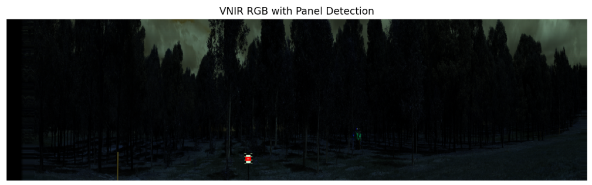
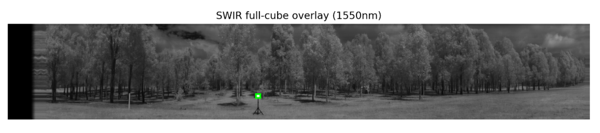
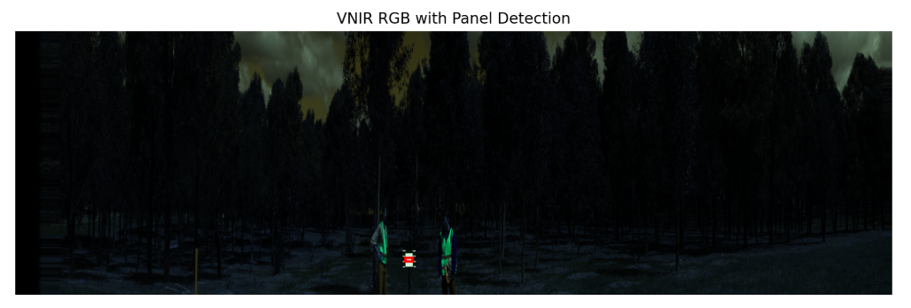
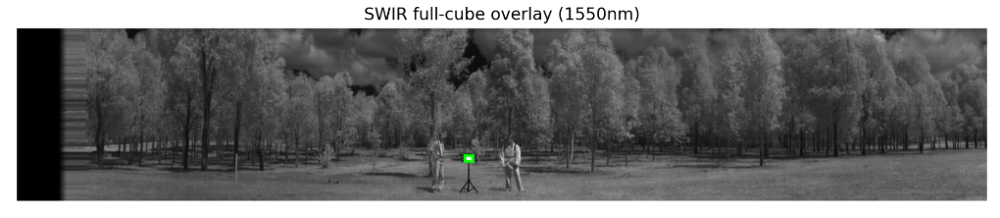
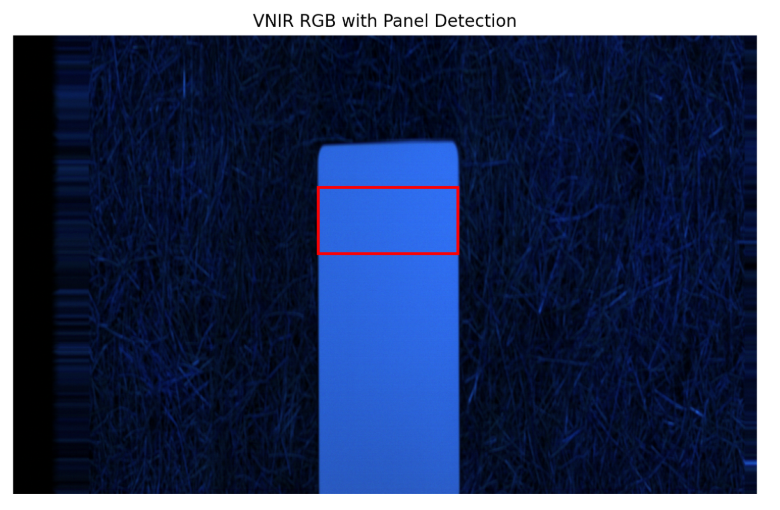
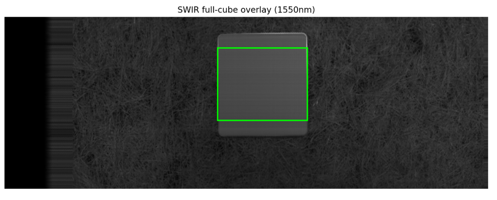
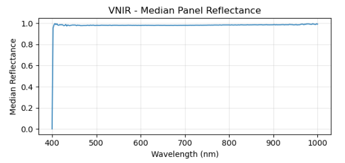
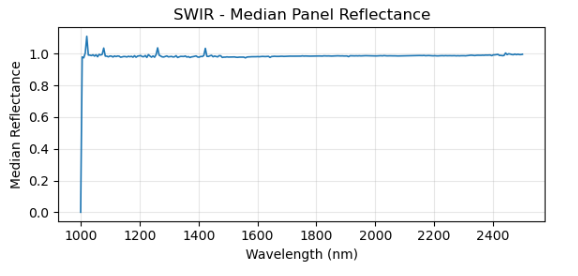

# Hyper_spectra_automation
## Automated white reference panel detection in VNIR and SWIR hyperspectral datacubes and reflectance cube processing:
Code to process spectrometer hyperspectral outputs. This project is primarily written in Python and consists of Python helper functions (`panel_reflectance_pipeline.py`) and a Jupyter Notebook (`auto_spectra.ipynb`) that orchestrates the workflow and visualises the data. The code processes multiple hyperspectral data cubes (both VNIR and SWIR), performs automatic reflectance calibration panel detection, and converts raw spectral data to reflectance, integrating scan metadata.  

[](https://doi.org/10.5281/zenodo.17656617)

## Features
- Recursive processing of hyperspectral `.bin` files across date/instrument subfolders.  
- Automatic calibration panel detection (VNIR & SWIR).  
- Reflectance calculation using calibration panels.  
- Export of results as NetCDF (`.nc`) files and CSV summaries.   
- Visualisation and verification plots of processed data.

## Workflow Overview

The workflow is implemented in a Jupyter Notebook and follows these steps:

1. **Imports & Configuration Paths**  
   - Load required Python libraries and define paths to raw data, calibration files, and output directories.

2. **Automated panel detection workflow**  
   - Import functions from `panel_reflectance_pipeline.py` for data processing and analysis.
   - Iterates through scan subfolders, working on the instrument output (reordered .bin datacube files). The detection is based on brightness, pixel thresholding and for SWIR, a subset region based on the VNIR detection which is more robust.

3. **Panel-based Reflectance Conversion Pipeline - VNIR & SWIR**  
   - Uses the detected panel regions and for both VNIR and SWIR, using the panel calibration file "LARGE_PANEL.txt".
   - Computes the median reflectance value for the panel region, saves this as a .csv, and processes the original datacube to a reflectance datacube.
   - Reads the day's metadata Index.txt and position info and appends the matching metadata entry to each pair of reflectance NetCDF files.

4. **Panel Detection Recovery Workflow (Manual Reflectance Assignment)**  
   - Exists as a catch for failed panel detection files.
   - It reads the error report (.txt, if exists) to show which files need to have a panel region applied and allows the use of an adjacent scan (that had successful panel detection) to use that reflectance median for either VNIR / SWIR and apply datacube reflectance conversion based on the supplied reflectance panel data.

5. **Interactive NetCDF Reflectance Cube Viewer**  
   - Allows you to specify a netCDF reflectance cube to examine how it looks.

## Usage

1. Clone this repository:

```bash
git clone https://github.com/Eric-git-999/Hyper_spectra_automation.git
cd Hyper_spectra_automation
```
```text
move or copy the notebook 'auto_spectra.ipynb', python file 'panel_reflectance_pipeline.py' and panel calibration file,
'LARGE_PANEL.txt' to your working directory, above the data folders:
```
```text
Base directory (save and run the Jupyter notebook and files here)

    Date folder 1 (i.e. 20241002)>
        Metadata
        Hyper >
            Scan1_SCN 
                > VNIR .bin file 1
            Scan2_SCN 
                > VNIR .bin file 2
            etc
        SWIR > 
            Scan1 
                > SWIR .bin file 1
            Scan2 
                > SWIR .bin file 2
            etc
            
    Date folder 2 (i.e. 20241003>
        Metadata
        Hyper >
            Scan1_SCN 
                > VNIR .bin file 1
            Scan2_SCN 
                > VNIR .bin file 2
            etc
        SWIR > 
            Scan1 
                > SWIR .bin file 1
            Scan2 
                > SWIR .bin file 2
            etc
    etc
```


2. Open the main Jupyter Notebook:
```bash
jupyter notebook auto_spectra.ipynb
```

3. Configure paths and run each cell sequentially. Ensure dependencies are installed, it is recommended to set up a new Conda environemnt for this workflow.


## Dependencies

This workflow requires the following Python libraries:

- Python 3.8 or higher
- NumPy
- Pandas
- Matplotlib
- xarray
- netCDF4
- os
- collections
- skimage
- scipy.ndimage
- IPython.display
- importlib
- gc
- json
- re
- Any other libraries listed in the notebook or in `requirements.txt`

## Output

After running the workflow, the following outputs will be generated:

- Processed hyperspectral reflectance datacubes saved as NetCDF (`.nc`) files, for both VNIR and SWIR cubes
- Median panel reflectance values, saved as a .csv for each scan
- Verification plots for visual inspection, showing panel detection regions and representations of the imported datacubes with panel detection overlay

## Example Notebook Outputs: panel detection verification imagery, check reflectance datacube (SWIR)











