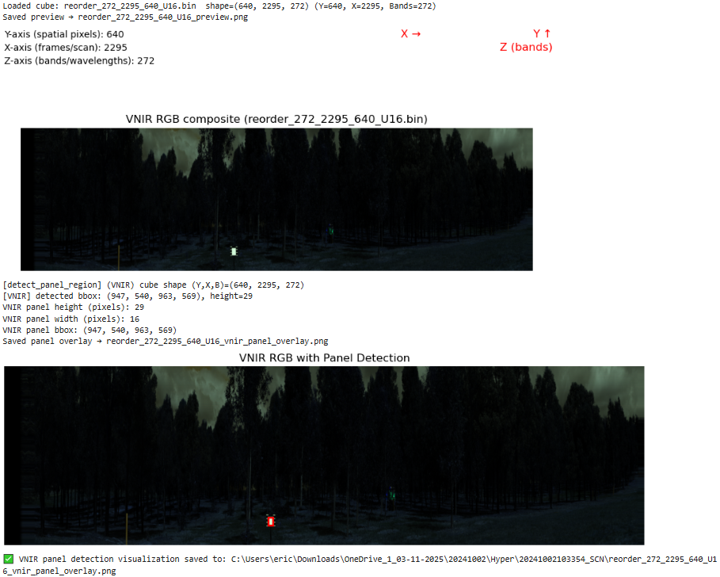
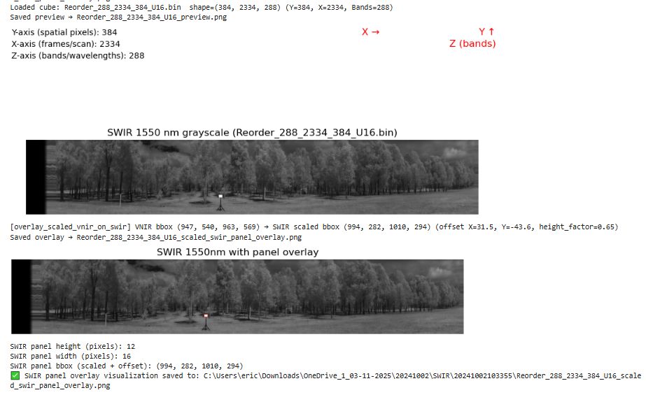
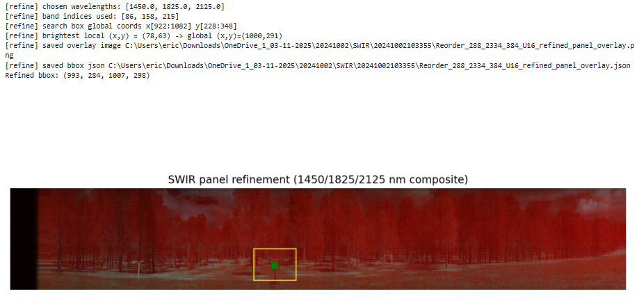
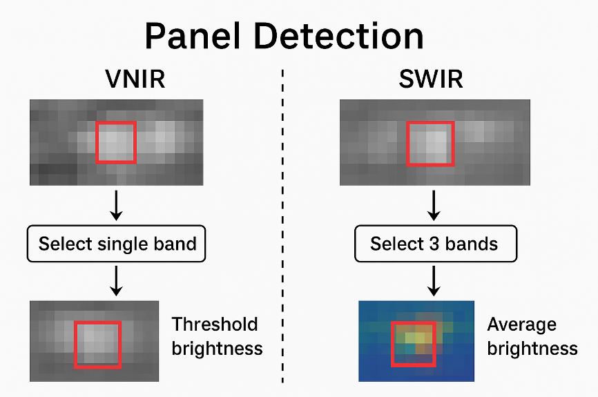

# Hyper_spectra_automation

Code to process ANU Forest Spectrometer outputs. This project is primarily written in Python and consists of a processing pipeline (`panel_reflectance_pipeline.py`) and a Jupyter Notebook that orchestrates the workflow and visualizes the data. The code processes multiple hyperspectral data cubes, performs automatic calibration panel detection, and converts raw spectral data to reflectance, integrating scan metadata along the way.  

## Features
- Recursive processing of hyperspectral `.bin` files across date/instrument subfolders.  
- Automatic calibration panel detection (VNIR & SWIR).  
- Reflectance calculation using calibration panels.  
- Export of results as NetCDF (`.nc`) files and CSV summaries.  
- Interactive selection region adjustment for verification and correction.  
- Visualization and verification plots of processed data.

## Workflow Overview

The workflow is implemented in a Jupyter Notebook and follows these steps:

1. **Imports & Configuration Paths**  
   - Load required Python libraries and define paths to raw data, calibration files, and output directories.

2. **Pipeline Module Import**  
   - Import functions from `panel_reflectance_pipeline.py` for data processing and analysis.

3. **Test Run: Panel Detection**  
   - Run a first test of panel selection to display detected panel regions.

4. **Calibration File Check**  
   - Verify reflectance calibration panel data and parameters.

5. **Recursive Multi-Folder Processing**  
   - Walk through all date/instrument folders and process each SWIR/VNIR `.bin` file automatically.

6. **Interactive Panel Polygon Editor (Optional)**  
   - Adjust or redraw detected panel regions visually and recompute averages.

7. **SWIR Panel Detection Refinement**  
   - Revise SWIR panel detection to ensure robust pixel identification.

8. **Panel Reflectance Extraction**  
   - Compute and save reflectance values as NetCDF files.

9. **Vegetation Reflectance Extraction**  
   - Extract regions around the panel and save averaged vegetation reflectance as NetCDF files.

10. **Output Review & Export**  
    - Inspect `.nc` outputs, export CSVs, and generate verification plots.

## Usage

1. Clone this repository:

```bash
git clone https://github.com/Eric-git-999/Hyper_spectra_automation.git
cd Hyper_spectra_automation
```

2. Open the main Jupyter Notebook:
```bash
jupyter notebook ANU_Forest_Spectrometer_Workflow.ipynb
```

3. Configure paths and run each cell sequentially.

4. Optional: Adjust panel regions interactively as needed.

## Dependencies

This workflow requires the following Python libraries:

- Python 3.8 or higher
- NumPy
- Pandas
- Matplotlib
- xarray
- netCDF4
- Any other libraries listed in the notebook or in `requirements.txt`

## Output

After running the workflow, the following outputs will be generated:

- Processed hyperspectral data saved as NetCDF (`.nc`) files
- Averaged vegetation reflectance outputs
- CSV summaries and verification plots for visual inspection

## Example Notebook Output (Panel detection, setting panel region for reflectance calculation)





**VNIR Panel Detection (detect_panel_region)**

**Goal:** Find the bright calibration panel in a VNIR datacube (visible + near-infrared light).

**How it works, step by step:**

- **Pick a single band to work with**
  - The datacube has many spectral bands. We usually pick a "middle" band (default is the middle band) to analyze brightness.
- **Normalize brightness**
  - Convert the pixel values in that band to a 0-1 scale so it's easier to find bright spots.
- **Thresholding**
  - Anything brighter than 90% of the maximum brightness is considered "bright enough" to be part of the panel.
  - This creates a **mask**: a 2D map of pixels that are likely panel pixels.
- **Find panel boundaries**
  - Look at the coordinates of all "bright pixels."
  - Take the minimum and maximum x and y coordinates → this defines a bounding box around the panel.

✅ **Result:** Bounding box (x1, y1, x2, y2) and the approximate panel height/width.

**SWIR Panel Detection (detect_swir_panel_single_pass)**

**Goal:** Find the bright calibration panel in a SWIR datacube (shortwave infrared). SWIR is trickier than VNIR because panels are less bright and detectors differ.

**How it works, step by step:**

- **Select 3 representative wavelengths**
  - Pick three wavelengths across the SWIR range (default 30%, 55%, 75% of 1000-2500 nm).
  - Avoid wavelengths where water absorption or detector noise is strong (shifts them slightly).
- **Make a small 3-band "subcube"**
  - Take only these three bands to reduce data size.
  - Compute the **average brightness** across the 3 bands for each pixel → a 2D brightness map.
- **Find the brightest pixel**
  - Look for the pixel with the highest brightness → likely somewhere inside the panel.
- **Estimate panel size**
  - SWIR panels can't be detected as precisely as VNIR, so the code uses a "nominal" size based on the image width (e.g., 5% of the image width).
- **Build a square bounding box**
  - Centered on the brightest pixel, with side = nominal panel size.
  - Makes sure the box stays inside the image bounds.
- **Optional overlay**
  - Draw a preview image with the detected panel outlined in red.
  - Save it for verification.

✅ **Result:** Bounding box (x1, y1, x2, y2) for the SWIR panel.



